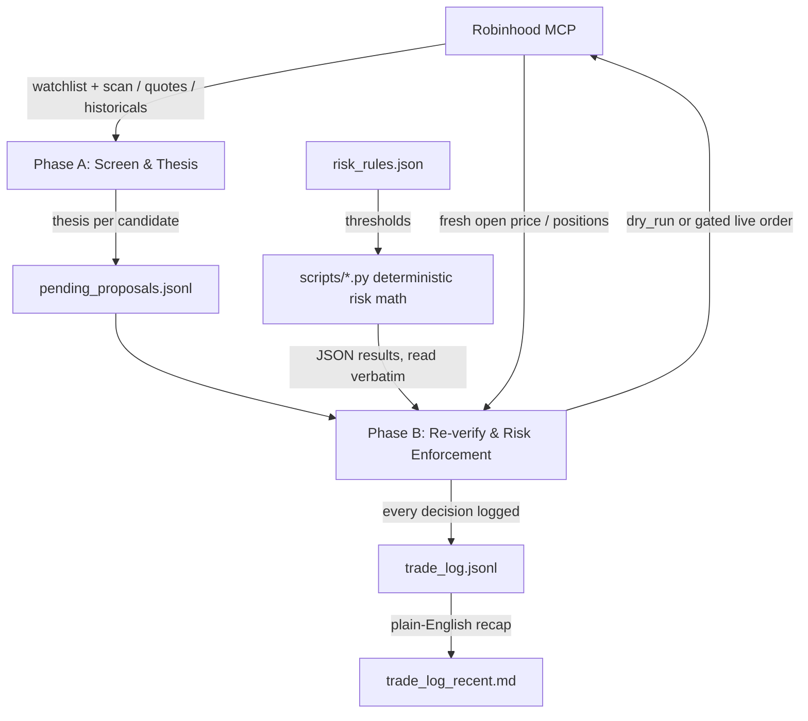

# FriesTrader


An AI trading agent built to run cheap and fully on its own, trading real
orders on [Robinhood](https://robinhood.com) using its
[Agentic Trading MCP server](https://robinhood.com/us/en/agentic-trading/).
Once set up, it's able to run unattended on its own schedule every
weekday, no manual triggering needed, and the actual safety mechanism is
mechanical, auditable risk rules, not the model's judgment. Two short
scheduled Claude Code sessions a day screen stocks, write out their
reasoning, and (only under a narrow, explicit gate) place real trades,
without a team of specialized sub-agents burning tokens on every
decision. Because it's just two lean sessions instead of a multi-agent
pipeline, it runs comfortably on a Claude Pro subscription (as low as
$200/year on the annual plan), no Claude Max or metered API spend
required.

This is a template/framework extracted from a real, live deployment.
Adapt it, don't just run it blind — read "What this does and doesn't
solve" below before pointing it at real money.

> If you build on this, a star, a fork, or a link back to this repo is
> always appreciated.

## Why this is safer than it sounds

"Fully autonomous" and "trading real money" together should make you
nervous. Here's what actually stands between a thesis and an order:

- **Every trade passes through mechanical rules the LLM cannot
  override** — position sizing, stop-loss, take-profit, loss limits, a
  wash-sale guard, each computed by a small stdlib-only Python script in
  `scripts/` rather than the model doing arithmetic in prose. Same
  inputs always produce the same numbers, and a good story never cancels
  a stop-loss.
- **New deployments start in `dry_run` and stay there** for a minimum
  number of cycles (`dry_run_min_cycles_before_live`) before a live
  order is even possible, so you can watch it screen and reason before
  it touches real money.
- **Only you can flip `execution.mode` to `"live"`** — the agent is
  explicitly barred from ever changing this itself, and refuses to
  place live orders while `dry_run`.
- **Every decision is logged, approved or rejected** — `trade_log.jsonl`
  is append-only, so you can check whether the reasoning is actually
  sound, not just trust it.

## Requirements

- A [Robinhood](https://robinhood.com) account with
  [Agentic Trading](https://robinhood.com/us/en/agentic-trading/) enabled,
  connected via Robinhood's own MCP server.
- [Claude Code](https://claude.com/claude-code), on a Pro subscription or
  higher.
- A GitHub account, to host your own copy of this repo — only needed
  for the cloud-hosted deployment (see "How it works" below for the
  cloud vs. local tradeoff).

## How it works

Trading runs as **two separate phases, on two separate schedules** — a
full trading day's closing data feeds the thesis, and a fresh opening
price is used for the actual order, rather than trading on a stale
overnight price.



- **Phase A** (Steps 1–3, ~4:30pm Central weekdays) — screens candidates
  from your watchlist plus a supplementary market scan, gathers signals,
  writes a logged thesis per candidate to `pending_proposals.jsonl`.
  Places no orders, not even dry-run ones.
  Full spec: `PHASE_A_TASK.md`.
- **Phase B** (Steps 4–9, ~8:35am Central weekdays) — re-verifies Phase A's
  proposals against fresh opening data, enforces `risk_rules.json`
  mechanically, and dry-runs or (gated) places orders. Full spec:
  `PHASE_B_TASK.md`.

Both are designed to run as cloud-hosted scheduled agent sessions,
independent of any local machine — each run clones this repo fresh and
commits/pushes its results back to `main`, so the repo itself is the
persistent state, not local disk. (Running locally instead works too,
but only fires while your machine is on and available at each
scheduled time.)

- `risk_rules.json` — the hard, mechanical limits (position sizing, stop-
  loss, loss limits, universe filters, execution mode, wash-sale guard).
  Nothing in this system should be able to override these. Several
  fields need your own account details before this is usable — see
  First-time setup below.
- `scripts/` — the deterministic risk-math engines Phase B runs instead
  of hand-computing anything, each a standalone Python 3 script (stdlib
  only, no dependencies) you can run and inspect on its own:
  - `entry_gate.py` — every independent, per-symbol condition that can
    block a buy (price-gap ceiling, moving-average extension ceiling,
    wash-sale avoidance, sell re-entry lock), in one script call.
  - `pnl_pct.py` — daily/weekly loss-limit % against `starting_capital_usd`,
    and the entries-halted decision.
  - `stop_loss.py` — the fixed or volatility-scaled stop_pct (clamped,
    sample-stdev of daily returns), including the trailing-high reference
    price once a take-profit tier has fired, and the trigger decision.
  - `take_profit.py` — tiered partial-exit firing, cascading quantity
    correctly when a single cycle's gain jumps past more than one
    not-yet-fired tier at once.
  - `conviction_trim.py` — mechanically trims a held position back to
    its conviction-tier target after several consecutive
    low-conviction, overweight cycles.
  - `rank_candidates.py` — the conviction / risk_flags / pct_below_52wk_high
    priority sort new entries and top-ups compete on.
  - `position_sizing.py` — position/top-up sizing and the concurrency/
    cash-buffer checks, compounding running totals down the ranked list.

  Each takes plain CLI args, prints one JSON object, and is meant to be
  read from directly rather than re-derived — see `PHASE_B_TASK.md`
  Steps 5 and 7 for the exact call shape of each
  (`stop_loss.py`/`take_profit.py`/`conviction_trim.py` in Step 5;
  `entry_gate.py`/`pnl_pct.py`/`rank_candidates.py`/`position_sizing.py`
  in Step 7).
- `PHASE_A_TASK.md` / `PHASE_B_TASK.md` — the full, self-contained spec
  each phase follows.
- `trade_log_template.jsonl` — the log line shapes; real logs accumulate
  in `trade_log.jsonl` in this same style.

## See it in action

This is what a real Phase B cycle actually produces (`trade_log_recent.md`,
regenerated every run, symbols genericized):

> **2026-07-09**
>
> **Loss limit**: OK — daily 0.0%, weekly -2.1%, within -5%/-10% limits.
>
> **Held positions** (stop-loss / take-profit):
> - EXAMPLE — stop 7.00% (vol-scaled), drawdown -2.3% — holding
>
> **New-entry candidates considered**: OTHER, ANOTHER
> - OTHER — approved: medium conviction, $60.00 (12% of account)
> - ANOTHER — rejected: max_concurrent_positions already filled this cycle
>
> **Orders placed**: OTHER — buy $60.00 (dry_run)

No JSON parsing required to see what it did and why. Full field-level
examples (thesis records, raw `trade_log.jsonl` lines) are further down
in Example output.

## What this does and doesn't solve

- It gives you a structured, auditable version of "let an LLM screen and
  reason about trades" instead of an opaque one.
- It does **not** make LLM-driven stock picking more likely to beat a
  simple index fund — there's no established track record for that, and
  this can't backtest the reasoning step honestly (news-based reasoning
  can't be validated against historical data the model may already know
  the outcome of).
- The risk rules are the actual safety mechanism here, not the reasoning
  quality. Treat loosening them as the highest-risk change you can make
  to this system.
- This is a template extracted from a real deployment trading a small
  personal account, shared for others to learn from or adapt. It is
  genuinely not financial advice, and running it against real money is
  entirely your own decision and risk.

## First-time setup

**Get your own copy first:**

- **Cloud-hosted scheduled sessions (recommended)**: these commit and
  push results back to `main`, so you need a repo you actually control.
  - **Running this against your own account**: click **"Use this
    template"** (top of this repo's GitHub page) and make the result
    **private** — it'll accumulate real trading data
    (`trade_log.jsonl`, proposals) once running.
  - **Building a public variant**, not running your own account:
    **Fork** it — keeps a link back here and an easy "Sync fork" button
    for updates.
- **Running locally**: skip this — just clone or download the
  repo; state lives on local disk, but your machine needs to be on and
  available at each scheduled run time.

See "Keeping your copy updated" below for pulling in future
improvements.

1. Robinhood's [Agentic Trading](https://robinhood.com/us/en/agentic-trading/)
   requires a separate, dedicated account — distinct from your regular
   investing account, and restricted to only the funds you put in it. See
   that page to open one and connect its MCP server to Claude Code (or to
   your routine's MCP connections). Nothing below works without this:
   every tool call in `PHASE_A_TASK.md`/`PHASE_B_TASK.md` (quotes,
   positions, orders, etc.) goes through it.
2. Fill in `account_number` in `risk_rules.json` with your own Robinhood
   account number, set `starting_capital_usd` to your real starting
   balance, set `universe.watchlist_name` to a watchlist you've already
   created and populated in your Robinhood account, and review every
   other threshold — the defaults here are illustrative, not a
   recommendation.
3. Create a scan via the Robinhood MCP's `create_scan` tool — whatever
   screening conditions you like — then paste its ID into
   `universe.supplementary_scan_id`. Phase A calls this scan every run
   to surface movers outside your watchlist — left as the placeholder,
   that call fails every cycle.
4. Fill in `wash_sale_avoidance.linked_accounts` with every Robinhood
   account number you personally control, not just this one — if this is
   genuinely the only account you trade in, a single-entry list (just
   this account's number) is enough. Leave `enabled: true` unless you
   specifically want buys never blocked on wash-sale grounds.
5. Keep `execution.mode` set to `"dry_run"`. Leave it there for at least
   the number of cycles set in `dry_run_min_cycles_before_live` — don't
   shortcut this.
6. After each cycle, read `trade_log.jsonl` yourself. Look specifically
   at rejected candidates and stop-loss triggers, not just the trades
   that "worked" — that's where you'll see if the reasoning step is
   actually sound or just getting lucky with an uptrend.
7. Only flip `execution.mode` to `"live"` yourself, by hand, after you've
   reviewed enough dry-run cycles to trust the output. Do not let the
   agent flip it for you as a shortcut.

## Keeping your copy updated

This template gets improvements over time.

- **If you forked**: GitHub's "Sync fork" button, on your repo's main
  page. No local git needed. Works cleanly as long as nothing conflicts
  with your own changes.
- **If you used the template (or "Sync fork" refuses on a conflict,
  usually in `risk_rules.json`)**, resolve locally:
  ```
  git remote add upstream https://github.com/YizhiSong/FriesTrader.git
  git fetch upstream
  git merge upstream/main
  ```
  Resolve any conflicts in `risk_rules.json` by hand — your own account
  details and thresholds should win, not upstream's placeholders.

## Running it

Two schedules need to fire: Phase A around 4:30pm Central on weekdays
(hand Claude Code `PHASE_A_TASK.md` to execute), and Phase B around
8:35am Central on weekdays, 5 minutes after market open (hand it
`PHASE_B_TASK.md`). Each run is a fresh Claude Code session pointed at
this repo — no state needs to persist locally between runs, since the
repo itself (`risk_rules.json`, `pending_proposals.jsonl`,
`trade_log.jsonl`) is what's read and written each time.

- **Recommended: Claude Code's own scheduled cloud routines.** Set one
  routine to run `PHASE_A_TASK.md` on the Phase A schedule and a second
  for `PHASE_B_TASK.md` on the Phase B schedule, with the routine's
  source pointed at **your copy** from First-time setup, not this repo.
  This runs independent of any machine being on — the actual point of
  "fully automated."
- **Alternative: a local scheduler** (cron, Windows Task Scheduler, etc.)
  invoking the Claude Code CLI against your copy on the same two
  schedules. Works, but only while that machine is running, and you're
  responsible for keeping the repo synced (`git pull` before, `git push`
  after each run) since the repo — not local disk — is the source of
  truth. If you go this route, make sure only one scheduler is ever
  active for a given phase — two schedulers firing the same phase in the
  same cycle risks duplicate `risk_check`/`order` log entries, or
  duplicate real orders once `execution.mode` is `"live"`.

### Routine prompt templates

The task specs don't cover scheduling, dates, or saving results — that's
up to whatever runs them. These are the real prompts this project's live
deployment uses; copy one in and swap in your own account number.

#### Phase A prompt

```
You are running the DAILY automated Phase A step (screening & thesis only) for a small real personal trading account on Robinhood (account_number: <your Robinhood account_number>). This repo has already been cloned into your working directory. PHASE_A_TASK.md in this checkout is the full source-of-truth spec for what to do (Steps 1-3) — read and follow it exactly.

First, determine today's REAL date, day-of-week, and time-of-day in America/Chicago (Central) via Bash — do not guess or infer these:
TZ='America/Chicago' date +'%Y-%m-%d'
TZ='America/Chicago' date +'%A'
TZ='America/Chicago' date +'%H:%M:%S'
Use the date as the 'date' field and the time as the 'timestamp' field (time-of-day only, e.g. "16:30:01" — never prepend the date to it) on every line you write, per PHASE_A_TASK.md's Output section.

Read risk_rules.json fresh from this checkout every run — never assume prior values or cache across runs.

Follow PHASE_A_TASK.md's Steps 1-3 exactly, including the screened/thesis/summary line shapes and the End-of-run summary section. Overwrite pending_proposals.jsonl in this checkout with this run's results (do not append to prior contents). Do NOT touch trade_log.jsonl.

Hard stop: place_equity_order, review_equity_order, place_option_order, review_option_order, cancel_equity_order, and cancel_option_order should not be available to you in this session (exclude them at the connector level if your MCP setup allows it) — do not attempt them regardless, and do not check or reference execution.mode.

When pending_proposals.jsonl is fully written, commit and push it back to this repo's main branch:
git add pending_proposals.jsonl
git commit -m "Phase A run <date> <timestamp>"
git push origin main
If the push is rejected (e.g. a race with another run), run 'git pull --rebase origin main' once and retry the push once. If it still fails, report the exact conflict/error in your final summary rather than force-pushing or discarding either side's changes.

End with a concise summary of what you screened/filtered/proposed, and confirm the push succeeded (include the resulting commit hash).
```

#### Phase B prompt

```
You are running the DAILY automated Phase B step (re-verify, risk enforcement, order review/execution, logging) for a small real personal trading account on Robinhood (account_number: <your Robinhood account_number>). This repo has already been cloned into your working directory. PHASE_B_TASK.md in this checkout is the full source-of-truth spec for what to do (Steps 4-9) — read and follow it exactly.

First, determine today's REAL date, day-of-week, and time-of-day in America/Chicago (Central) via Bash — do not guess or infer these, and do not compute day-of-week yourself from the date string:
TZ='America/Chicago' date +'%Y-%m-%d'
TZ='America/Chicago' date +'%A'
TZ='America/Chicago' date +'%H:%M:%S'
Use the date as the 'date' field and the time as the 'timestamp' field (time-of-day only, e.g. "08:35:01" — never prepend the date to it) on every line you write to trade_log.jsonl, per PHASE_B_TASK.md. Determine is_monday from the day-of-week output (true only if it's literally 'Monday') for the Step 7 weekend-gap check.

Read risk_rules.json fresh from this checkout every run — never assume prior values or cache across runs. Read pending_proposals.jsonl and trade_log.jsonl fresh from this checkout too.

Follow PHASE_B_TASK.md's Steps 4-9 exactly, including the idempotency rule (key off each candidate's own proposal_date, not today's date), the dry-run cycle count rule, the priority/tiebreak rules, and the live-order gate (Step 6 for sells, Step 8 for buys). This task is authorized to place real live orders only under that gate's narrow, explicit condition. Do not add, remove, or loosen any condition of that gate on your own judgment, and never change execution.mode or any other value in risk_rules.json yourself.

Append every decision to trade_log.jsonl (do not touch pending_proposals.jsonl except to read it). When done, commit and push trade_log.jsonl back to this repo's main branch:
git add trade_log.jsonl
git commit -m "Phase B run <date> <timestamp>"
git push origin main
If the push is rejected (e.g. a race with another run), run 'git pull --rebase origin main' once and retry the push once. If it still fails, report the exact conflict/error in your final summary rather than force-pushing or discarding either side's changes — this file is an append-only audit trail, treat any conflict here as serious and report it clearly rather than guessing how to resolve it.

End with a concise summary of what you checked, approved, rejected, and (if applicable) placed, and confirm the push succeeded (include the resulting commit hash).
```

### Example output

**Phase A — thesis record** (one JSON line per candidate in
`pending_proposals.jsonl`):

```json
{
  "date": "YYYY-MM-DD",
  "timestamp": "HH:mm:ss",
  "symbol": "XXXX",
  "stage": "thesis",
  "thesis": "1-3 sentences on what changed and why it might matter",
  "conviction": "low | medium | high",
  "invalidation": "what would prove this thesis wrong",
  "direction": "long | avoid | exit_existing",
  "risk_flags": ["..."],
  "pct_below_52wk_high": 0.15,
  "sources": ["Outlet Name: https://...", "..."]
}
```

`risk_flags` and `pct_below_52wk_high` are only included when
`direction` is `"long"` — omitted for `avoid`/`exit_existing`.

- **No price targets** — no reliable basis for a specific number, and it
  invites false precision.
- **No forecasting language treated as fact** — "this suggests...", not
  "this will...".

**Phase B — `trade_log.jsonl`** (the durable, append-only source of
truth — one line per decision; `trade_log_recent.md`, shown under "See
it in action" above, is just its daily recap):

```json
{"date": "2026-07-10", "timestamp": "08:38:10", "symbol": "EXAMPLE", "stage": "risk_check", "passed": true, "conviction": "medium", "risk_flags": [], "pct_below_52wk_high": 0.08, "proposal_date": "2026-07-09", "position_size_usd": 60.00, "concurrent_positions_after": 2, "cash_remaining_after": 340.00, "cash_buffer_after_pct": 0.34}
{"date": "2026-07-09", "timestamp": "08:35:12", "symbol": "EXAMPLE", "stage": "order", "mode": "dry_run", "action": "buy", "dollar_amount": 60.00, "quote_ask": 84.20, "quantity": 0.712, "would_execute": true, "review_alerts": "none (order_checks empty)", "proposal_date": "2026-07-09"}
{"date": "2026-07-10", "timestamp": "08:38:30", "symbol": "OTHER", "stage": "stop_loss", "entry_price": 100.00, "current_price": 92.50, "stop_pct_used": 0.075, "stdev_20d": 0.030, "drawdown_pct": 0.075, "triggered": true, "action": "sell_full_position"}
```

## License

MIT — see `LICENSE`. Provided as-is, with no warranty; see the license
for the full disclaimer.
